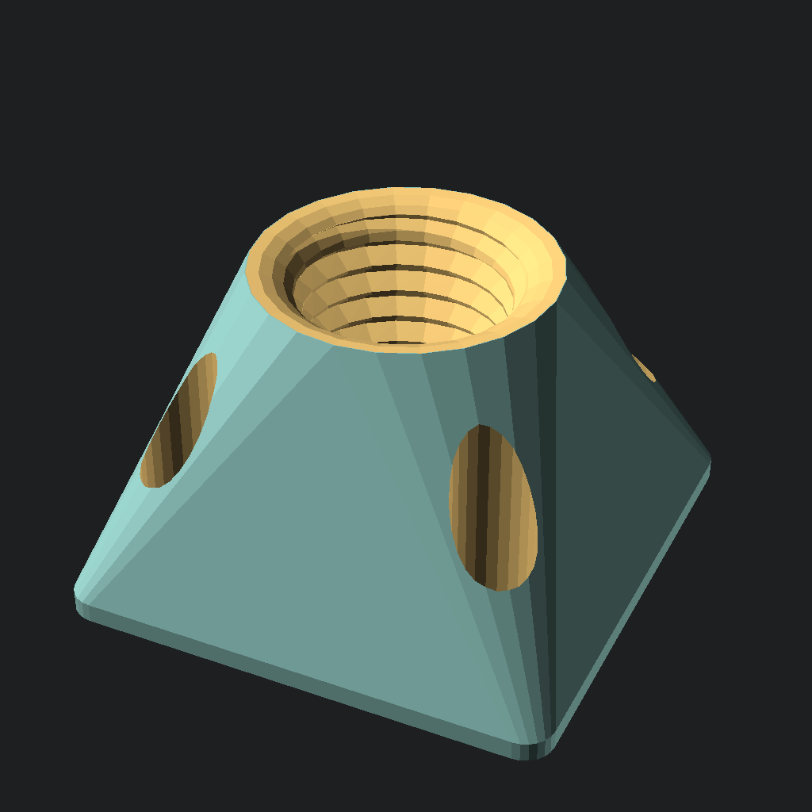
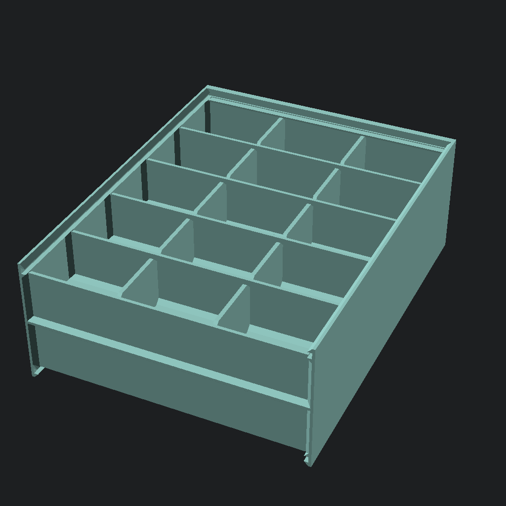
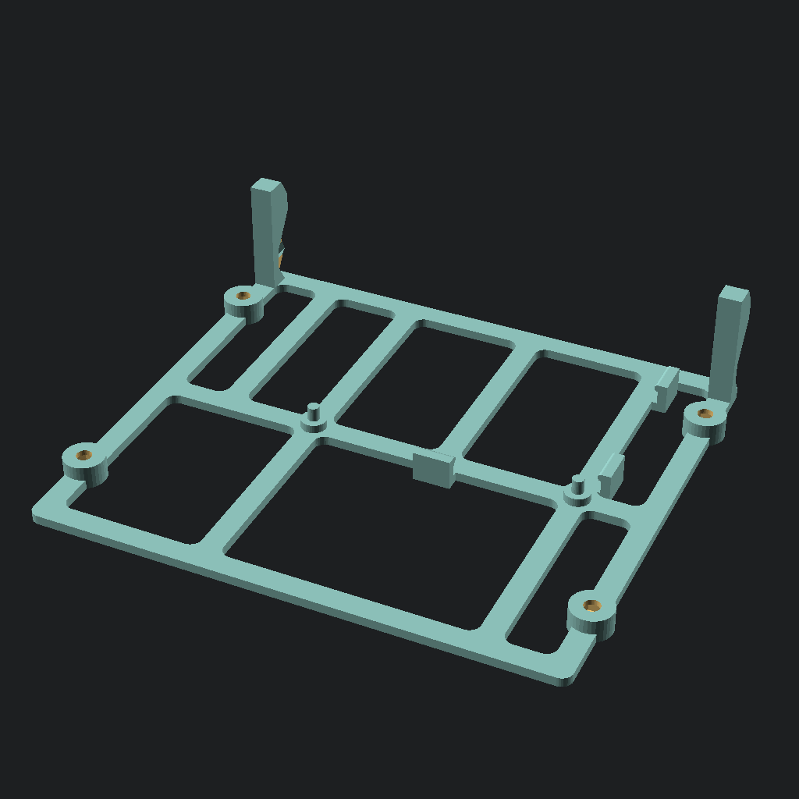
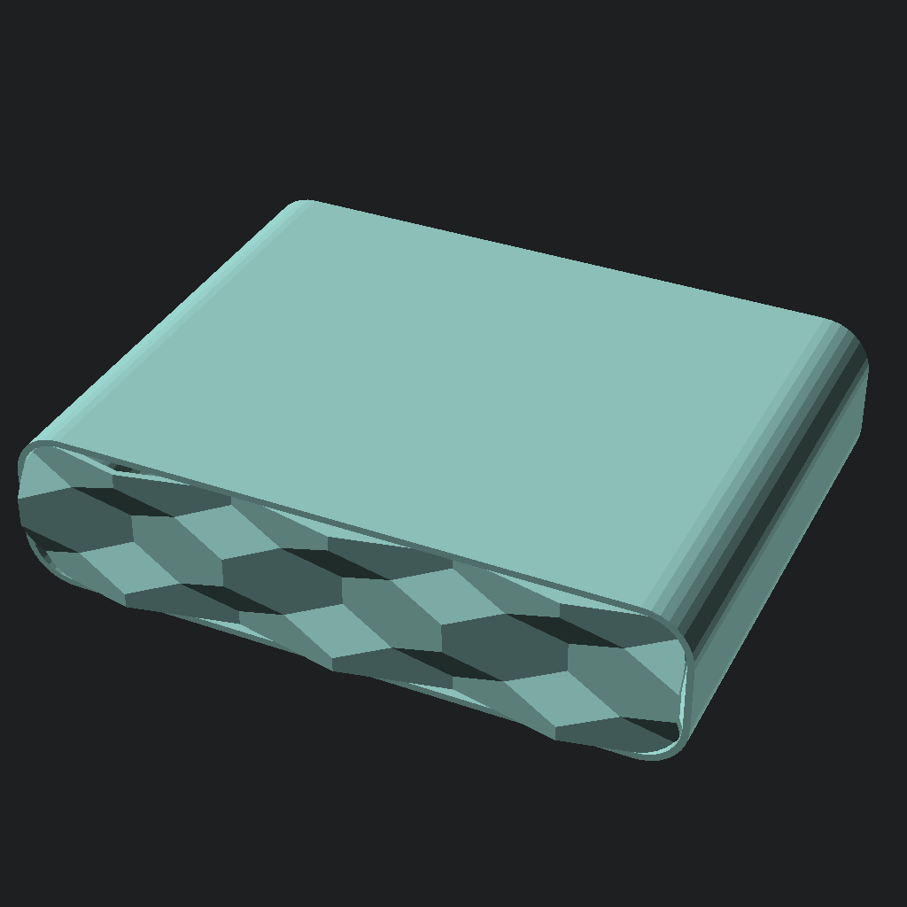

# OpenSCAD models


|  |  |  |
| --- | --- | --- |
| Continuous tracks, that can be printed in place. | Pole holder | Doublesided assortment box |
|  |  | |
| Pcb holder of music streamer |  Preview of music streamer | |

## Usage

OpenSCAD has to be on the path.

```sh
make_models.py -f continous_track.scad -e stl   # generates stl file for single piece
make_models.py -l model_list -e png             # renders preview for all models in model_list
```